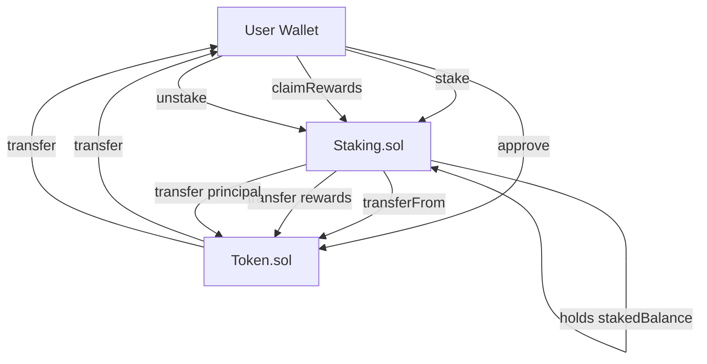
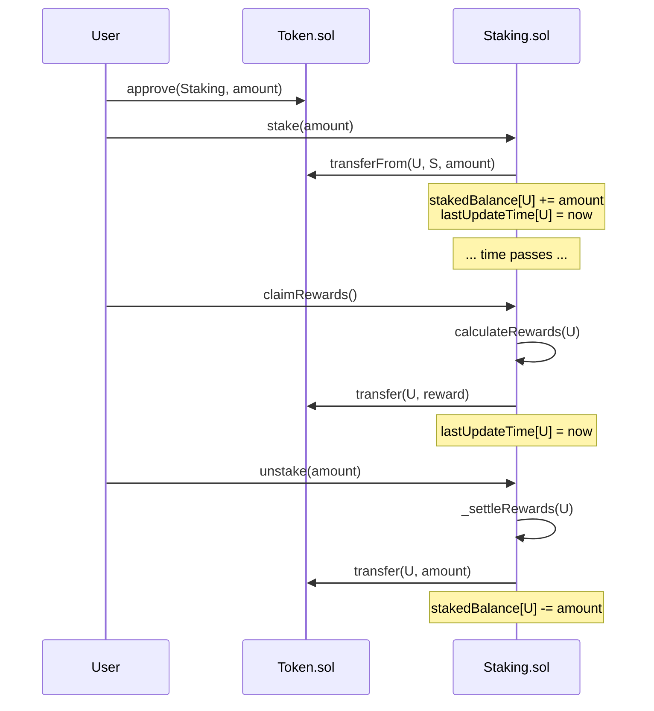

# base_network_staking
git rm generate_100_commits.py "base repo"
#!/bin/bash
set -e  # stop immediately if any command fails

# ============================================================
# base-token-staking — Commits 1-10 (setup phase)
# Run this from inside your cloned repo folder.
# Each commit is pushed immediately after it's made.
# ============================================================

echo "Starting setup commits..."

# ------------------------------------------------------------
# Commit 1: remove placeholder commit-generator script
# (Only relevant if you're working inside base_network_project.
#  Safe to leave in — it does nothing if the files don't exist.)
# ------------------------------------------------------------
git rm -f generate_100_commits.py 2>/dev/null || true
git rm -f "base repo" 2>/dev/null || true
git commit -m "chore: remove placeholder commit-generator script" --allow-empty
git push origin main

# ------------------------------------------------------------
# Commit 2: rewrite README with real project overview
# ------------------------------------------------------------
cat > README.md << 'EOF'
# Base Token Staking

A simple ERC-20 token + staking contract built and deployed on Base.

## Overview
This project implements:
- An ERC-20 token contract
- A staking contract that lets users stake the token and earn rewards over time

Built with [Foundry](https://book.getfoundry.sh/), deployed to Base Sepolia (testnet) and Base mainnet.

## Status
🚧 In progress — building in public, commit by commit.

## Stack
- Solidity
- Foundry
- OpenZeppelin Contracts
- Base (Sepolia + Mainnet)

## Deployed Addresses
_TBD — will be added once deployed._

## License
MIT
EOF

git add README.md
git commit -m "docs: rewrite README with real project overview"
git push origin main

# ------------------------------------------------------------
# Commit 3: add .gitignore
# ------------------------------------------------------------
cat > .gitignore << 'EOF'
# Foundry
cache/
out/
broadcast/

# Env
.env
.env.local

# Node
node_modules/

# OS
.DS_Store
EOF

git add .gitignore
git commit -m "chore: add .gitignore"
git push origin main

# ------------------------------------------------------------
# Commit 4: add MIT license
# (Skip if GitHub already generated LICENSE for you — script checks first)
# ------------------------------------------------------------
if [ ! -f LICENSE ]; then
cat > LICENSE << 'EOF'
MIT License

Copyright (c) 2026 bullettin

Permission is hereby granted, free of charge, to any person obtaining a copy
of this software and associated documentation files (the "Software"), to deal
in the Software without restriction, including without limitation the rights
to use, copy, modify, merge, publish, distribute, sublicense, and/or sell
copies of the Software, and to permit persons to whom the Software is
furnished to do so, subject to the following conditions:

The above copyright notice and this permission notice shall be included in all
copies or substantial portions of the Software.

THE SOFTWARE IS PROVIDED "AS IS", WITHOUT WARRANTY OF ANY KIND, EXPRESS OR
IMPLIED, INCLUDING BUT NOT LIMITED TO THE WARRANTIES OF MERCHANTABILITY,
FITNESS FOR A PARTICULAR PURPOSE AND NONINFRINGEMENT. IN NO EVENT SHALL THE
AUTHORS OR COPYRIGHT HOLDERS BE LIABLE FOR ANY CLAIM, DAMAGES OR OTHER
LIABILITY, WHETHER IN AN ACTION OF CONTRACT, TORT OR OTHERWISE, ARISING FROM,
OUT OF OR IN CONNECTION WITH THE SOFTWARE OR THE USE OR OTHER DEALINGS IN THE
SOFTWARE.
EOF
git add LICENSE
git commit -m "chore: add MIT license"
git push origin main
else
  echo "LICENSE already exists, skipping commit 4."
fi

# ------------------------------------------------------------
# Commit 5: init Foundry project structure
# Requires Foundry installed: curl -L https://foundry.paradigm.xyz | bash && foundryup
# ------------------------------------------------------------
forge init --force --no-commit
git add .
git commit -m "chore: init Foundry project structure"
git push origin main

# ------------------------------------------------------------
# Commit 6: configure foundry.toml
# ------------------------------------------------------------
cat > foundry.toml << 'EOF'
[profile.default]
src = "src"
out = "out"
libs = ["lib"]
solc = "0.8.24"
optimizer = true
optimizer_runs = 200

[rpc_endpoints]
base_sepolia = "${BASE_SEPOLIA_RPC_URL}"
base_mainnet = "${BASE_MAINNET_RPC_URL}"
EOF

git add foundry.toml
git commit -m "chore: configure foundry.toml"
git push origin main

# ------------------------------------------------------------
# Commit 7: add Base network RPC config docs
# ------------------------------------------------------------
mkdir -p docs
cat > docs/networks.md << 'EOF'
# Network Configuration

## Base Sepolia (testnet)
- Chain ID: 84532
- RPC: https://sepolia.base.org
- Explorer: https://sepolia.basescan.org

## Base Mainnet
- Chain ID: 8453
- RPC: https://mainnet.base.org
- Explorer: https://basescan.org
EOF

git add docs/networks.md
git commit -m "chore: add Base network RPC config"
git push origin main

# ------------------------------------------------------------
# Commit 8: add .env.example
# ------------------------------------------------------------
cat > .env.example << 'EOF'
# Copy this file to .env and fill in real values. Never commit .env!

BASE_SEPOLIA_RPC_URL=https://sepolia.base.org
BASE_MAINNET_RPC_URL=https://mainnet.base.org
PRIVATE_KEY=your_private_key_here
BASESCAN_API_KEY=your_basescan_api_key_here
EOF

git add .env.example
git commit -m "chore: add .env.example"
git push origin main

# ------------------------------------------------------------
# Commit 9: install OpenZeppelin contracts
# ------------------------------------------------------------
forge install OpenZeppelin/openzeppelin-contracts --no-commit
git add .
git commit -m "chore: install OpenZeppelin contracts"
git push origin main

# ----------#!/bin/bash
set -e  # stop immediately if any command fails

# ============================================================
# base-token-staking — Commits 11-30 (Token.sol)
# Run this from inside your repo folder, AFTER setup_commits.sh
# ============================================================

echo "Starting Token.sol commits..."

# ------------------------------------------------------------
# Commit 11: scaffold Token.sol
# ------------------------------------------------------------
cat > src/Token.sol << 'EOF'
// SPDX-License-Identifier: MIT
pragma solidity ^0.8.24;

import "../lib/openzeppelin-contracts/contracts/token/ERC20/ERC20.sol";

contract Token is ERC20 {
    constructor() ERC20("", "") {}
}
EOF

git add src/Token.sol
git commit -m "feat: scaffold Token.sol"
git push origin main

# ------------------------------------------------------------
# Commit 12: set token name and symbol
# ------------------------------------------------------------
cat > src/Token.sol << 'EOF'
// SPDX-License-Identifier: MIT
pragma solidity ^0.8.24;

import "../lib/openzeppelin-contracts/contracts/token/ERC20/ERC20.sol";

contract Token is ERC20 {
    constructor() ERC20("Base Stake Token", "BST") {}
}
EOF

git add src/Token.sol
git commit -m "feat: set token name and symbol"
git push origin main

# ------------------------------------------------------------
# Commit 13: set token decimals
# (ERC20 default is 18, so we explicitly override to document intent)
# ------------------------------------------------------------
cat > src/Token.sol << 'EOF'
// SPDX-License-Identifier: MIT
pragma solidity ^0.8.24;

import "../lib/openzeppelin-contracts/contracts/token/ERC20/ERC20.sol";

contract Token is ERC20 {
    constructor() ERC20("Base Stake Token", "BST") {}

    function decimals() public view virtual override returns (uint8) {
        return 18;
    }
}
EOF

git add src/Token.sol
git commit -m "feat: set token decimals"
git push origin main

# ------------------------------------------------------------
# Commit 14: mint initial supply to deployer
# ------------------------------------------------------------
cat > src/Token.sol << 'EOF'
// SPDX-License-Identifier: MIT
pragma solidity ^0.8.24;

import "../lib/openzeppelin-contracts/contracts/token/ERC20/ERC20.sol";

contract Token is ERC20 {
    uint256 public constant INITIAL_SUPPLY = 1_000_000 * 10 ** 18;

    constructor() ERC20("Base Stake Token", "BST") {
        _mint(msg.sender, INITIAL_SUPPLY);
    }

    function decimals() public view virtual override returns (uint8) {
        return 18;
    }
}
EOF

git add src/Token.sol
git commit -m "feat: mint initial supply to deployer"
git push origin main

# ------------------------------------------------------------
# Commit 15: add Ownable for access control
# ------------------------------------------------------------
cat > src/Token.sol << 'EOF'
// SPDX-License-Identifier: MIT
pragma solidity ^0.8.24;

import "../lib/openzeppelin-contracts/contracts/token/ERC20/ERC20.sol";
import "../lib/openzeppelin-contracts/contracts/access/Ownable.sol";

contract Token is ERC20, Ownable {
    uint256 public constant INITIAL_SUPPLY = 1_000_000 * 10 ** 18;

    constructor() ERC20("Base Stake Token", "BST") Ownable(msg.sender) {
        _mint(msg.sender, INITIAL_SUPPLY);
    }

    function decimals() public view virtual override returns (uint8) {
        return 18;
    }
}
EOF

git add src/Token.sol
git commit -m "feat: add Ownable for access control"
git push origin main

# ------------------------------------------------------------
# Commit 16: add owner-only mint function
# ------------------------------------------------------------
cat > src/Token.sol << 'EOF'
// SPDX-License-Identifier: MIT
pragma solidity ^0.8.24;

import "../lib/openzeppelin-contracts/contracts/token/ERC20/ERC20.sol";
import "../lib/openzeppelin-contracts/contracts/access/Ownable.sol";

contract Token is ERC20, Ownable {
    uint256 public constant INITIAL_SUPPLY = 1_000_000 * 10 ** 18;

    constructor() ERC20("Base Stake Token", "BST") Ownable(msg.sender) {
        _mint(msg.sender, INITIAL_SUPPLY);
    }

    function decimals() public view virtual override returns (uint8) {
        return 18;
    }

    function mint(address to, uint256 amount) external onlyOwner {
        _mint(to, amount);
    }
}
EOF

git add src/Token.sol
git commit -m "feat: add owner-only mint function"
git push origin main

# ------------------------------------------------------------
# Commit 17: add max supply cap
# ------------------------------------------------------------
cat > src/Token.sol << 'EOF'
// SPDX-License-Identifier: MIT
pragma solidity ^0.8.24;

import "../lib/openzeppelin-contracts/contracts/token/ERC20/ERC20.sol";
import "../lib/openzeppelin-contracts/contracts/access/Ownable.sol";

contract Token is ERC20, Ownable {
    uint256 public constant INITIAL_SUPPLY = 1_000_000 * 10 ** 18;
    uint256 public constant MAX_SUPPLY = 10_000_000 * 10 ** 18;

    constructor() ERC20("Base Stake Token", "BST") Ownable(msg.sender) {
        _mint(msg.sender, INITIAL_SUPPLY);
    }

    function decimals() public view virtual override returns (uint8) {
        return 18;
    }

    function mint(address to, uint256 amount) external onlyOwner {
        require(totalSupply() + amount <= MAX_SUPPLY, "Token: max supply exceeded");
        _mint(to, amount);
    }
}
EOF

git add src/Token.sol
git commit -m "feat: add max supply cap"
git push origin main

# ------------------------------------------------------------
# Commit 18: add burn functionality
# ------------------------------------------------------------
cat > src/Token.sol << 'EOF'
// SPDX-License-Identifier: MIT
pragma solidity ^0.8.24;

import "../lib/openzeppelin-contracts/contracts/token/ERC20/ERC20.sol";
import "../lib/openzeppelin-contracts/contracts/token/ERC20/extensions/ERC20Burnable.sol";
import "../lib/openzeppelin-contracts/contracts/access/Ownable.sol";

contract Token is ERC20, ERC20Burnable, Ownable {
    uint256 public constant INITIAL_SUPPLY = 1_000_000 * 10 ** 18;
    uint256 public constant MAX_SUPPLY = 10_000_000 * 10 ** 18;

    constructor() ERC20("Base Stake Token", "BST") Ownable(msg.sender) {
        _mint(msg.sender, INITIAL_SUPPLY);
    }

    function decimals() public view virtual override returns (uint8) {
        return 18;
    }

    function mint(address to, uint256 amount) external onlyOwner {
        require(totalSupply() + amount <= MAX_SUPPLY, "Token: max supply exceeded");
        _mint(to, amount);
    }
}
EOF

git add src/Token.sol
git commit -m "feat: add burn functionality"
git push origin main

# ------------------------------------------------------------
# Commit 19: add NatSpec comments to Token.sol
# ------------------------------------------------------------
cat > src/Token.sol << 'EOF'
// SPDX-License-Identifier: MIT
pragma solidity ^0.8.24;

import "../lib/openzeppelin-contracts/contracts/token/ERC20/ERC20.sol";
import "../lib/openzeppelin-contracts/contracts/token/ERC20/extensions/ERC20Burnable.sol";
import "../lib/openzeppelin-contracts/contracts/access/Ownable.sol";

/// @title Base Stake Token (BST)
/// @notice ERC20 token used for staking rewards on Base
/// @dev Capped supply, owner-mintable, holder-burnable
contract Token is ERC20, ERC20Burnable, Ownable {
    /// @notice Amount minted to the deployer on construction
    uint256 public constant INITIAL_SUPPLY = 1_000_000 * 10 ** 18;

    /// @notice Hard cap on total minted supply
    uint256 public constant MAX_SUPPLY = 10_000_000 * 10 ** 18;

    /// @notice Deploys the token and mints the initial supply to the deployer
    constructor() ERC20("Base Stake Token", "BST") Ownable(msg.sender) {
        _mint(msg.sender, INITIAL_SUPPLY);
    }

    /// @notice Returns the number of decimals used for display purposes
    function decimals() public view virtual override returns (uint8) {
        return 18;
    }

    /// @notice Mints new tokens to a given address
    /// @dev Only callable by the owner. Reverts if it would exceed MAX_SUPPLY
    /// @param to Recipient of the minted tokens
    /// @param amount Amount of tokens to mint (in wei units, 18 decimals)
    function mint(address to, uint256 amount) external onlyOwner {
        require(totalSupply() + amount <= MAX_SUPPLY, "Token: max supply exceeded");
        _mint(to, amount);
    }
}
EOF

git add src/Token.sol
git commit -m "docs: add NatSpec comments to Token.sol"
git push origin main

# ------------------------------------------------------------
# Commit 20: scaffold Token.t.sol
# ------------------------------------------------------------
cat > test/Token.t.sol << 'EOF'
// SPDX-License-Identifier: MIT
pragma solidity ^0.8.24;

import "forge-std/Test.sol";
import "../src/Token.sol";

contract TokenTest is Test {
    Token token;
    address owner = address(0x1);
    address user = address(0x2);

    function setUp() public {
        vm.prank(owner);
        token = new Token();
    }
}
EOF

git add test/Token.t.sol
git commit -m "test: scaffold Token.t.sol"
git push origin main

# ------------------------------------------------------------
# Commit 21: add deployment test
# ------------------------------------------------------------
cat > test/Token.t.sol << 'EOF'
// SPDX-License-Identifier: MIT
pragma solidity ^0.8.24;

import "forge-std/Test.sol";
import "../src/Token.sol";

contract TokenTest is Test {
    Token token;
    address owner = address(0x1);
    address user = address(0x2);

    function setUp() public {
        vm.prank(owner);
        token = new Token();
    }

    function test_DeploymentSetsNameSymbolSupply() public view {
        assertEq(token.name(), "Base Stake Token");
        assertEq(token.symbol(), "BST");
        assertEq(token.totalSupply(), token.INITIAL_SUPPLY());
        assertEq(token.balanceOf(owner), token.INITIAL_SUPPLY());
    }
}
EOF

git add test/Token.t.sol
git commit -m "test: add deployment test"
git push origin main

# ------------------------------------------------------------
# Commit 22: add mint test
# ------------------------------------------------------------
cat > test/Token.t.sol << 'EOF'
// SPDX-License-Identifier: MIT
pragma solidity ^0.8.24;

import "forge-std/Test.sol";
import "../src/Token.sol";

contract TokenTest is Test {
    Token token;
    address owner = address(0x1);
    address user = address(0x2);

    function setUp() public {
        vm.prank(owner);
        token = new Token();
    }

    function test_DeploymentSetsNameSymbolSupply() public view {
        assertEq(token.name(), "Base Stake Token");
        assertEq(token.symbol(), "BST");
        assertEq(token.totalSupply(), token.INITIAL_SUPPLY());
        assertEq(token.balanceOf(owner), token.INITIAL_SUPPLY());
    }

    function test_OwnerCanMint() public {
        vm.prank(owner);
        token.mint(user, 1000);
        assertEq(token.balanceOf(user), 1000);
    }

    function test_NonOwnerCannotMint() public {
        vm.prank(user);
        vm.expectRevert();
        token.mint(user, 1000);
    }
}
EOF

git add test/Token.t.sol
git commit -m "test: add mint test"
git push origin main

# ------------------------------------------------------------
# Commit 23: add burn test
# ------------------------------------------------------------
cat > test/Token.t.sol << 'EOF'
// SPDX-License-Identifier: MIT
pragma solidity ^0.8.24;

import "forge-std/Test.sol";
import "../src/Token.sol";

contract TokenTest is Test {
    Token token;
    address owner = address(0x1);
    address user = address(0x2);

    function setUp() public {
        vm.prank(owner);
        token = new Token();
    }

    function test_DeploymentSetsNameSymbolSupply() public view {
        assertEq(token.name(), "Base Stake Token");
        assertEq(token.symbol(), "BST");
        assertEq(token.totalSupply(), token.INITIAL_SUPPLY());
        assertEq(token.balanceOf(owner), token.INITIAL_SUPPLY());
    }

    function test_OwnerCanMint() public {
        vm.prank(owner);
        token.mint(user, 1000);
        assertEq(token.balanceOf(user), 1000);
    }

    function test_NonOwnerCannotMint() public {
        vm.prank(user);
        vm.expectRevert();
        token.mint(user, 1000);
    }

    function test_BurnReducesBalanceAndSupply() public {
        uint256 supplyBefore = token.totalSupply();
        vm.prank(owner);
        token.burn(500);
        assertEq(token.balanceOf(owner), token.INITIAL_SUPPLY() - 500);
        assertEq(token.totalSupply(), supplyBefore - 500);
    }
}
EOF

git add test/Token.t.sol
git commit -m "test: add burn test"
git push origin main

# ------------------------------------------------------------
# Commit 24: add max supply cap test
# ------------------------------------------------------------
cat > test/Token.t.sol << 'EOF'
// SPDX-License-Identifier: MIT
pragma solidity ^0.8.24;

import "forge-std/Test.sol";
import "../src/Token.sol";

contract TokenTest is Test {
    Token token;
    address owner = address(0x1);
    address user = address(0x2);

    function setUp() public {
        vm.prank(owner);
        token = new Token();
    }

    function test_DeploymentSetsNameSymbolSupply() public view {
        assertEq(token.name(), "Base Stake Token");
        assertEq(token.symbol(), "BST");
        assertEq(token.totalSupply(), token.INITIAL_SUPPLY());
        assertEq(token.balanceOf(owner), token.INITIAL_SUPPLY());
    }

    function test_OwnerCanMint() public {
        vm.prank(owner);
        token.mint(user, 1000);
        assertEq(token.balanceOf(user), 1000);
    }

    function test_NonOwnerCannotMint() public {
        vm.prank(user);
        vm.expectRevert();
        token.mint(user, 1000);
    }

    function test_BurnReducesBalanceAndSupply() public {
        uint256 supplyBefore = token.totalSupply();
        vm.prank(owner);
        token.burn(500);
        assertEq(token.balanceOf(owner), token.INITIAL_SUPPLY() - 500);
        assertEq(token.totalSupply(), supplyBefore - 500);
    }

    function test_MintBeyondMaxSupplyReverts() public {
        uint256 tooMuch = token.MAX_SUPPLY() - token.totalSupply() + 1;
        vm.prank(owner);
        vm.expectRevert("Token: max supply exceeded");
        token.mint(user, tooMuch);
    }
}
EOF

git add test/Token.t.sol
git commit -m "test: add max supply cap test"
git push origin main

echo ""
echo "PAUSE: run 'forge test' now before continuing."
echo "Commit 25 is a real fix commit, not pre-written - see comment in script."
echo ""

# ------------------------------------------------------------
# Commit 25: fix correct max supply check logic
#
# NOTE: Left as a manual step on purpose. Run `forge test` after
# commit 24. If everything passes, the cap logic was already
# correct - in that case skip ahead, don't force a fake fix commit.
# If forge test DOES reveal a bug (off-by-one in the cap check, a
# revert message mismatch, etc.), fix it in src/Token.sol, then run:
#
#   git add src/Token.sol
#   git commit -m "fix: correct max supply check logic"
#   git push origin main
# ------------------------------------------------------------

read -p "Press Enter once you've run 'forge test' and resolved/confirmed commit 25 to continue with commits 26-30..."

# ------------------------------------------------------------
# Commit 26: add transfer/approve tests
# ------------------------------------------------------------
cat >> test/Token.t.sol << 'EOF'

contract TokenTransferTest is Test {
    Token token;
    address owner = address(0x1);
    address alice = address(0x3);
    address bob = address(0x4);

    function setUp() public {
        vm.prank(owner);
        token = new Token();
        vm.prank(owner);
        token.transfer(alice, 1000);
    }

    function test_TransferMovesBalance() public {
        vm.prank(alice);
        token.transfer(bob, 400);
        assertEq(token.balanceOf(alice), 600);
        assertEq(token.balanceOf(bob), 400);
    }

    function test_ApproveAndTransferFrom() public {
        vm.prank(alice);
        token.approve(bob, 300);

        vm.prank(bob);
        token.transferFrom(alice, bob, 300);

        assertEq(token.balanceOf(alice), 700);
        assertEq(token.balanceOf(bob), 300);
    }
}
EOF

git add test/Token.t.sol
git commit -m "test: add transfer/approve tests"
git push origin main

# ------------------------------------------------------------
# Commit 27: extract magic numbers to constants
# ------------------------------------------------------------
cat > src/Token.sol << 'EOF'
// SPDX-License-Identifier: MIT
pragma solidity ^0.8.24;

import "../lib/openzeppelin-contracts/contracts/token/ERC20/ERC20.sol";
import "../lib/openzeppelin-contracts/contracts/token/ERC20/extensions/ERC20Burnable.sol";
import "../lib/openzeppelin-contracts/contracts/access/Ownable.sol";

/// @title Base Stake Token (BST)
/// @notice ERC20 token used for staking rewards on Base
/// @dev Capped supply, owner-mintable, holder-burnable
contract Token is ERC20, ERC20Burnable, Ownable {
    uint8 private constant TOKEN_DECIMALS = 18;
    uint256 private constant ONE_TOKEN = 10 ** TOKEN_DECIMALS;

    /// @notice Amount minted to the deployer on construction
    uint256 public constant INITIAL_SUPPLY = 1_000_000 * ONE_TOKEN;

    /// @notice Hard cap on total minted supply
    uint256 public constant MAX_SUPPLY = 10_000_000 * ONE_TOKEN;

    /// @notice Deploys the token and mints the initial supply to the deployer
    constructor() ERC20("Base Stake Token", "BST") Ownable(msg.sender) {
        _mint(msg.sender, INITIAL_SUPPLY);
    }

    /// @notice Returns the number of decimals used for display purposes
    function decimals() public view virtual override returns (uint8) {
        return TOKEN_DECIMALS;
    }

    /// @notice Mints new tokens to a given address
    /// @dev Only callable by the owner. Reverts if it would exceed MAX_SUPPLY
    /// @param to Recipient of the minted tokens
    /// @param amount Amount of tokens to mint (in wei units, 18 decimals)
    function mint(address to, uint256 amount) external onlyOwner {
        require(totalSupply() + amount <= MAX_SUPPLY, "Token: max supply exceeded");
        _mint(to, amount);
    }
}
EOF

git add src/Token.sol
git commit -m "refactor: extract magic numbers to constants"
git push origin main

# ------------------------------------------------------------
# Commit 28: run forge fmt on Token.sol
# ------------------------------------------------------------
forge fmt src/Token.sol test/Token.t.sol
git add src/Token.sol test/Token.t.sol
git commit -m "style: run forge fmt on Token.sol" --allow-empty
git push origin main

# ------------------------------------------------------------
# Commit 29: add gas snapshot for Token
# ------------------------------------------------------------
forge snapshot --match-contract TokenTest
git add .gas-snapshot
git commit -m "chore: add gas snapshot for Token"
git push origin main

# ------------------------------------------------------------
# Commit 30: document Token.sol in README
# ------------------------------------------------------------
cat >> README.md << 'EOF'

## Token Contract

`src/Token.sol` implements an ERC20 token (`BST`) with:
- Initial supply of 1,000,000 BST minted to the deployer
- A hard cap of 10,000,000 BST total supply
- Owner-only minting (capped, will revert beyond `MAX_SUPPLY`)
- Public burn functionality via `ERC20Burnable`
EOF

git add README.md
git commit -m "docs: document Token.sol in README"
git push origin main

echo ""
echo "Done. Commits 11-30 created and pushed (commit 25 handled manually above)."
echo "Run 'git log --oneline' to review them, and 'forge test' to confirm everything passes."--------------------------------------------------
# Commit 10: add CONTRIBUTING notes
# ------------------------------------------------------------
cat > CONTRIBUTING.md << 'EOF'
# Contributing

## Branching
- `main` is always deployable
- Feature work happens on short-lived branches, merged via PR

## Commit messages
Following conventional commits style:
- `feat:` new functionality
- `fix:` bug fixes
- `test:` test additions/changes
- `docs:` documentation only
- `chore:` tooling/config/maintenance
- `refactor:` code change with no behavior change
- `style:` formatting only

## Running tests
```bash
forge test
```
EOF

git add CONTRIBUTING.md
git commit -m "docs: add CONTRIBUTING notes"
git push origin main

echo ""
echo "✅ Done. 10 real commits created and pushed."
echo "Run 'git log --oneline' to review them."#!/bin/bash
set -e

# ============================================================
# base-token-staking — Commits 31-65 (Staking.sol)
# Run this from inside your repo folder, AFTER token_commits.sh
# ============================================================

echo "Starting Staking.sol commits..."

# ------------------------------------------------------------
# Commit 31: scaffold Staking.sol
# ------------------------------------------------------------
cat > src/Staking.sol << 'EOF'
// SPDX-License-Identifier: MIT
pragma solidity ^0.8.24;

import "../lib/openzeppelin-contracts/contracts/token/ERC20/IERC20.sol";

contract Staking {
    IERC20 public immutable stakingToken;

    constructor(address _stakingToken) {
        stakingToken = IERC20(_stakingToken);
    }
}
EOF

git add src/Staking.sol
git commit -m "feat: scaffold Staking.sol"
git push origin main

# ------------------------------------------------------------
# Commit 32: add stake() function
# ------------------------------------------------------------
cat > src/Staking.sol << 'EOF'
// SPDX-License-Identifier: MIT
pragma solidity ^0.8.24;

import "../lib/openzeppelin-contracts/contracts/token/ERC20/IERC20.sol";

contract Staking {
    IERC20 public immutable stakingToken;

    constructor(address _stakingToken) {
        stakingToken = IERC20(_stakingToken);
    }

    function stake(uint256 amount) external {
        stakingToken.transferFrom(msg.sender, address(this), amount);
    }
}
EOF

git add src/Staking.sol
git commit -m "feat: add stake() function"
git push origin main

# ------------------------------------------------------------
# Commit 33: add unstake() function
# ------------------------------------------------------------
cat > src/Staking.sol << 'EOF'
// SPDX-License-Identifier: MIT
pragma solidity ^0.8.24;

import "../lib/openzeppelin-contracts/contracts/token/ERC20/IERC20.sol";

contract Staking {
    IERC20 public immutable stakingToken;

    constructor(address _stakingToken) {
        stakingToken = IERC20(_stakingToken);
    }

    function stake(uint256 amount) external {
        stakingToken.transferFrom(msg.sender, address(this), amount);
    }

    function unstake(uint256 amount) external {
        stakingToken.transfer(msg.sender, amount);
    }
}
EOF

git add src/Staking.sol
git commit -m "feat: add unstake() function"
git push origin main

# ------------------------------------------------------------
# Commit 34: add staked balance mapping
# ------------------------------------------------------------
cat > src/Staking.sol << 'EOF'
// SPDX-License-Identifier: MIT
pragma solidity ^0.8.24;

import "../lib/openzeppelin-contracts/contracts/token/ERC20/IERC20.sol";

contract Staking {
    IERC20 public immutable stakingToken;

    mapping(address => uint256) public stakedBalance;

    constructor(address _stakingToken) {
        stakingToken = IERC20(_stakingToken);
    }

    function stake(uint256 amount) external {
        stakedBalance[msg.sender] += amount;
        stakingToken.transferFrom(msg.sender, address(this), amount);
    }

    function unstake(uint256 amount) external {
        require(stakedBalance[msg.sender] >= amount, "Staking: insufficient staked balance");
        stakedBalance[msg.sender] -= amount;
        stakingToken.transfer(msg.sender, amount);
    }
}
EOF

git add src/Staking.sol
git commit -m "feat: add staked balance mapping"
git push origin main

# ------------------------------------------------------------
# Commit 35: add total staked tracker
# ------------------------------------------------------------
cat > src/Staking.sol << 'EOF'
// SPDX-License-Identifier: MIT
pragma solidity ^0.8.24;

import "../lib/openzeppelin-contracts/contracts/token/ERC20/IERC20.sol";

contract Staking {
    IERC20 public immutable stakingToken;

    mapping(address => uint256) public stakedBalance;
    uint256 public totalStaked;

    constructor(address _stakingToken) {
        stakingToken = IERC20(_stakingToken);
    }

    function stake(uint256 amount) external {
        stakedBalance[msg.sender] += amount;
        totalStaked += amount;
        stakingToken.transferFrom(msg.sender, address(this), amount);
    }

    function unstake(uint256 amount) external {
        require(stakedBalance[msg.sender] >= amount, "Staking: insufficient staked balance");
        stakedBalance[msg.sender] -= amount;
        totalStaked -= amount;
        stakingToken.transfer(msg.sender, amount);
    }
}
EOF

git add src/Staking.sol
git commit -m "feat: add total staked tracker"
git push origin main

# ------------------------------------------------------------
# Commit 36: add reward rate variable
# ------------------------------------------------------------
cat > src/Staking.sol << 'EOF'
// SPDX-License-Identifier: MIT
pragma solidity ^0.8.24;

import "../lib/openzeppelin-contracts/contracts/token/ERC20/IERC20.sol";

contract Staking {
    IERC20 public immutable stakingToken;

    mapping(address => uint256) public stakedBalance;
    uint256 public totalStaked;

    /// @notice Reward tokens emitted per second, per token staked (scaled 1e18)
    uint256 public rewardRate;

    constructor(address _stakingToken) {
        stakingToken = IERC20(_stakingToken);
    }

    function stake(uint256 amount) external {
        stakedBalance[msg.sender] += amount;
        totalStaked += amount;
        stakingToken.transferFrom(msg.sender, address(this), amount);
    }

    function unstake(uint256 amount) external {
        require(stakedBalance[msg.sender] >= amount, "Staking: insufficient staked balance");
        stakedBalance[msg.sender] -= amount;
        totalStaked -= amount;
        stakingToken.transfer(msg.sender, amount);
    }
}
EOF

git add src/Staking.sol
git commit -m "feat: add reward rate variable"
git push origin main

# ------------------------------------------------------------
# Commit 37: add setRewardRate() owner function
# ------------------------------------------------------------
cat > src/Staking.sol << 'EOF'
// SPDX-License-Identifier: MIT
pragma solidity ^0.8.24;

import "../lib/openzeppelin-contracts/contracts/token/ERC20/IERC20.sol";
import "../lib/openzeppelin-contracts/contracts/access/Ownable.sol";

contract Staking is Ownable {
    IERC20 public immutable stakingToken;

    mapping(address => uint256) public stakedBalance;
    uint256 public totalStaked;

    /// @notice Reward tokens emitted per second, per token staked (scaled 1e18)
    uint256 public rewardRate;

    constructor(address _stakingToken) Ownable(msg.sender) {
        stakingToken = IERC20(_stakingToken);
    }

    function stake(uint256 amount) external {
        stakedBalance[msg.sender] += amount;
        totalStaked += amount;
        stakingToken.transferFrom(msg.sender, address(this), amount);
    }

    function unstake(uint256 amount) external {
        require(stakedBalance[msg.sender] >= amount, "Staking: insufficient staked balance");
        stakedBalance[msg.sender] -= amount;
        totalStaked -= amount;
        stakingToken.transfer(msg.sender, amount);
    }

    function setRewardRate(uint256 newRate) external onlyOwner {
        rewardRate = newRate;
    }
}
EOF

git add src/Staking.sol
git commit -m "feat: add setRewardRate() owner function"
git push origin main

# ------------------------------------------------------------
# Commit 38: add timestamp tracking per staker
# ------------------------------------------------------------
cat > src/Staking.sol << 'EOF'
// SPDX-License-Identifier: MIT
pragma solidity ^0.8.24;

import "../lib/openzeppelin-contracts/contracts/token/ERC20/IERC20.sol";
import "../lib/openzeppelin-contracts/contracts/access/Ownable.sol";

contract Staking is Ownable {
    IERC20 public immutable stakingToken;

    mapping(address => uint256) public stakedBalance;
    mapping(address => uint256) public lastUpdateTime;
    uint256 public totalStaked;

    /// @notice Reward tokens emitted per second, per token staked (scaled 1e18)
    uint256 public rewardRate;

    constructor(address _stakingToken) Ownable(msg.sender) {
        stakingToken = IERC20(_stakingToken);
    }

    function stake(uint256 amount) external {
        stakedBalance[msg.sender] += amount;
        totalStaked += amount;
        lastUpdateTime[msg.sender] = block.timestamp;
        stakingToken.transferFrom(msg.sender, address(this), amount);
    }

    function unstake(uint256 amount) external {
        require(stakedBalance[msg.sender] >= amount, "Staking: insufficient staked balance");
        stakedBalance[msg.sender] -= amount;
        totalStaked -= amount;
        lastUpdateTime[msg.sender] = block.timestamp;
        stakingToken.transfer(msg.sender, amount);
    }

    function setRewardRate(uint256 newRate) external onlyOwner {
        rewardRate = newRate;
    }
}
EOF

git add src/Staking.sol
git commit -m "feat: add timestamp tracking per staker"
git push origin main

# ------------------------------------------------------------
# Commit 39: add calculateRewards() view function
# ------------------------------------------------------------
cat > src/Staking.sol << 'EOF'
// SPDX-License-Identifier: MIT
pragma solidity ^0.8.24;

import "../lib/openzeppelin-contracts/contracts/token/ERC20/IERC20.sol";
import "../lib/openzeppelin-contracts/contracts/access/Ownable.sol";

contract Staking is Ownable {
    IERC20 public immutable stakingToken;

    mapping(address => uint256) public stakedBalance;
    mapping(address => uint256) public lastUpdateTime;
    uint256 public totalStaked;

    /// @notice Reward tokens emitted per second, per token staked (scaled 1e18)
    uint256 public rewardRate;

    constructor(address _stakingToken) Ownable(msg.sender) {
        stakingToken = IERC20(_stakingToken);
    }

    function stake(uint256 amount) external {
        stakedBalance[msg.sender] += amount;
        totalStaked += amount;
        lastUpdateTime[msg.sender] = block.timestamp;
        stakingToken.transferFrom(msg.sender, address(this), amount);
    }

    function unstake(uint256 amount) external {
        require(stakedBalance[msg.sender] >= amount, "Staking: insufficient staked balance");
        stakedBalance[msg.sender] -= amount;
        totalStaked -= amount;
        lastUpdateTime[msg.sender] = block.timestamp;
        stakingToken.transfer(msg.sender, amount);
    }

    function setRewardRate(uint256 newRate) external onlyOwner {
        rewardRate = newRate;
    }

    /// @notice Returns the reward tokens accrued by `user` since their last update
    function calculateRewards(address user) public view returns (uint256) {
        uint256 timeElapsed = block.timestamp - lastUpdateTime[user];
        return (stakedBalance[user] * rewardRate * timeElapsed) / 1e18;
    }
}
EOF

git add src/Staking.sol
git commit -m "feat: add calculateRewards() view function"
git push origin main

# ------------------------------------------------------------
# Commit 40: add claimRewards() function
# ------------------------------------------------------------
cat > src/Staking.sol << 'EOF'
// SPDX-License-Identifier: MIT
pragma solidity ^0.8.24;

import "../lib/openzeppelin-contracts/contracts/token/ERC20/IERC20.sol";
import "../lib/openzeppelin-contracts/contracts/access/Ownable.sol";

contract Staking is Ownable {
    IERC20 public immutable stakingToken;

    mapping(address => uint256) public stakedBalance;
    mapping(address => uint256) public lastUpdateTime;
    uint256 public totalStaked;

    /// @notice Reward tokens emitted per second, per token staked (scaled 1e18)
    uint256 public rewardRate;

    constructor(address _stakingToken) Ownable(msg.sender) {
        stakingToken = IERC20(_stakingToken);
    }

    function stake(uint256 amount) external {
        stakedBalance[msg.sender] += amount;
        totalStaked += amount;
        lastUpdateTime[msg.sender] = block.timestamp;
        stakingToken.transferFrom(msg.sender, address(this), amount);
    }

    function unstake(uint256 amount) external {
        require(stakedBalance[msg.sender] >= amount, "Staking: insufficient staked balance");
        stakedBalance[msg.sender] -= amount;
        totalStaked -= amount;
        lastUpdateTime[msg.sender] = block.timestamp;
        stakingToken.transfer(msg.sender, amount);
    }

    function setRewardRate(uint256 newRate) external onlyOwner {
        rewardRate = newRate;
    }

    /// @notice Returns the reward tokens accrued by `user` since their last update
    function calculateRewards(address user) public view returns (uint256) {
        uint256 timeElapsed = block.timestamp - lastUpdateTime[user];
        return (stakedBalance[user] * rewardRate * timeElapsed) / 1e18;
    }

    function claimRewards() external {
        uint256 reward = calculateRewards(msg.sender);
        lastUpdateTime[msg.sender] = block.timestamp;
        if (reward > 0) {
            stakingToken.transfer(msg.sender, reward);
        }
    }
}
EOF

git add src/Staking.sol
git commit -m "feat: add claimRewards() function"
git push origin main

# ------------------------------------------------------------
# Commit 41: add reentrancy guard
# ------------------------------------------------------------
cat > src/Staking.sol << 'EOF'
// SPDX-License-Identifier: MIT
pragma solidity ^0.8.24;

import "../lib/openzeppelin-contracts/contracts/token/ERC20/IERC20.sol";
import "../lib/openzeppelin-contracts/contracts/access/Ownable.sol";
import "../lib/openzeppelin-contracts/contracts/utils/ReentrancyGuard.sol";

contract Staking is Ownable, ReentrancyGuard {
    IERC20 public immutable stakingToken;

    mapping(address => uint256) public stakedBalance;
    mapping(address => uint256) public lastUpdateTime;
    uint256 public totalStaked;

    /// @notice Reward tokens emitted per second, per token staked (scaled 1e18)
    uint256 public rewardRate;

    constructor(address _stakingToken) Ownable(msg.sender) {
        stakingToken = IERC20(_stakingToken);
    }

    function stake(uint256 amount) external nonReentrant {
        stakedBalance[msg.sender] += amount;
        totalStaked += amount;
        lastUpdateTime[msg.sender] = block.timestamp;
        stakingToken.transferFrom(msg.sender, address(this), amount);
    }

    function unstake(uint256 amount) external nonReentrant {
        require(stakedBalance[msg.sender] >= amount, "Staking: insufficient staked balance");
        stakedBalance[msg.sender] -= amount;
        totalStaked -= amount;
        lastUpdateTime[msg.sender] = block.timestamp;
        stakingToken.transfer(msg.sender, amount);
    }

    function setRewardRate(uint256 newRate) external onlyOwner {
        rewardRate = newRate;
    }

    /// @notice Returns the reward tokens accrued by `user` since their last update
    function calculateRewards(address user) public view returns (uint256) {
        uint256 timeElapsed = block.timestamp - lastUpdateTime[user];
        return (stakedBalance[user] * rewardRate * timeElapsed) / 1e18;
    }

    function claimRewards() external nonReentrant {
        uint256 reward = calculateRewards(msg.sender);
        lastUpdateTime[msg.sender] = block.timestamp;
        if (reward > 0) {
            stakingToken.transfer(msg.sender, reward);
        }
    }
}
EOF

git add src/Staking.sol
git commit -m "feat: add reentrancy guard"
git push origin main

# ------------------------------------------------------------
# Commit 42: add Staked event
# ------------------------------------------------------------
cat > src/Staking.sol << 'EOF'
// SPDX-License-Identifier: MIT
pragma solidity ^0.8.24;

import "../lib/openzeppelin-contracts/contracts/token/ERC20/IERC20.sol";
import "../lib/openzeppelin-contracts/contracts/access/Ownable.sol";
import "../lib/openzeppelin-contracts/contracts/utils/ReentrancyGuard.sol";

contract Staking is Ownable, ReentrancyGuard {
    IERC20 public immutable stakingToken;

    mapping(address => uint256) public stakedBalance;
    mapping(address => uint256) public lastUpdateTime;
    uint256 public totalStaked;

    uint256 public rewardRate;

    event Staked(address indexed user, uint256 amount);

    constructor(address _stakingToken) Ownable(msg.sender) {
        stakingToken = IERC20(_stakingToken);
    }

    function stake(uint256 amount) external nonReentrant {
        stakedBalance[msg.sender] += amount;
        totalStaked += amount;
        lastUpdateTime[msg.sender] = block.timestamp;
        stakingToken.transferFrom(msg.sender, address(this), amount);
        emit Staked(msg.sender, amount);
    }

    function unstake(uint256 amount) external nonReentrant {
        require(stakedBalance[msg.sender] >= amount, "Staking: insufficient staked balance");
        stakedBalance[msg.sender] -= amount;
        totalStaked -= amount;
        lastUpdateTime[msg.sender] = block.timestamp;
        stakingToken.transfer(msg.sender, amount);
    }

    function setRewardRate(uint256 newRate) external onlyOwner {
        rewardRate = newRate;
    }

    function calculateRewards(address user) public view returns (uint256) {
        uint256 timeElapsed = block.timestamp - lastUpdateTime[user];
        return (stakedBalance[user] * rewardRate * timeElapsed) / 1e18;
    }

    function claimRewards() external nonReentrant {
        uint256 reward = calculateRewards(msg.sender);
        lastUpdateTime[msg.sender] = block.timestamp;
        if (reward > 0) {
            stakingToken.transfer(msg.sender, reward);
        }
    }
}
EOF

git add src/Staking.sol
git commit -m "feat: add Staked event"
git push origin main

# ------------------------------------------------------------
# Commit 43: add Unstaked event
# ------------------------------------------------------------
cat > src/Staking.sol << 'EOF'
// SPDX-License-Identifier: MIT
pragma solidity ^0.8.24;

import "../lib/openzeppelin-contracts/contracts/token/ERC20/IERC20.sol";
import "../lib/openzeppelin-contracts/contracts/access/Ownable.sol";
import "../lib/openzeppelin-contracts/contracts/utils/ReentrancyGuard.sol";

contract Staking is Ownable, ReentrancyGuard {
    IERC20 public immutable stakingToken;

    mapping(address => uint256) public stakedBalance;
    mapping(address => uint256) public lastUpdateTime;
    uint256 public totalStaked;

    uint256 public rewardRate;

    event Staked(address indexed user, uint256 amount);
    event Unstaked(address indexed user, uint256 amount);

    constructor(address _stakingToken) Ownable(msg.sender) {
        stakingToken = IERC20(_stakingToken);
    }

    function stake(uint256 amount) external nonReentrant {
        stakedBalance[msg.sender] += amount;
        totalStaked += amount;
        lastUpdateTime[msg.sender] = block.timestamp;
        stakingToken.transferFrom(msg.sender, address(this), amount);
        emit Staked(msg.sender, amount);
    }

    function unstake(uint256 amount) external nonReentrant {
        require(stakedBalance[msg.sender] >= amount, "Staking: insufficient staked balance");
        stakedBalance[msg.sender] -= amount;
        totalStaked -= amount;
        lastUpdateTime[msg.sender] = block.timestamp;
        stakingToken.transfer(msg.sender, amount);
        emit Unstaked(msg.sender, amount);
    }

    function setRewardRate(uint256 newRate) external onlyOwner {
        rewardRate = newRate;
    }

    function calculateRewards(address user) public view returns (uint256) {
        uint256 timeElapsed = block.timestamp - lastUpdateTime[user];
        return (stakedBalance[user] * rewardRate * timeElapsed) / 1e18;
    }

    function claimRewards() external nonReentrant {
        uint256 reward = calculateRewards(msg.sender);
        lastUpdateTime[msg.sender] = block.timestamp;
        if (reward > 0) {
            stakingToken.transfer(msg.sender, reward);
        }
    }
}
EOF

git add src/Staking.sol
git commit -m "feat: add Unstaked event"
git push origin main

# ------------------------------------------------------------
# Commit 44: add RewardPaid event
# ------------------------------------------------------------
cat > src/Staking.sol << 'EOF'
// SPDX-License-Identifier: MIT
pragma solidity ^0.8.24;

import "../lib/openzeppelin-contracts/contracts/token/ERC20/IERC20.sol";
import "../lib/openzeppelin-contracts/contracts/access/Ownable.sol";
import "../lib/openzeppelin-contracts/contracts/utils/ReentrancyGuard.sol";

contract Staking is Ownable, ReentrancyGuard {
    IERC20 public immutable stakingToken;

    mapping(address => uint256) public stakedBalance;
    mapping(address => uint256) public lastUpdateTime;
    uint256 public totalStaked;

    uint256 public rewardRate;

    event Staked(address indexed user, uint256 amount);
    event Unstaked(address indexed user, uint256 amount);
    event RewardPaid(address indexed user, uint256 reward);

    constructor(address _stakingToken) Ownable(msg.sender) {
        stakingToken = IERC20(_stakingToken);
    }

    function stake(uint256 amount) external nonReentrant {
        stakedBalance[msg.sender] += amount;
        totalStaked += amount;
        lastUpdateTime[msg.sender] = block.timestamp;
        stakingToken.transferFrom(msg.sender, address(this), amount);
        emit Staked(msg.sender, amount);
    }

    function unstake(uint256 amount) external nonReentrant {
        require(stakedBalance[msg.sender] >= amount, "Staking: insufficient staked balance");
        stakedBalance[msg.sender] -= amount;
        totalStaked -= amount;
        lastUpdateTime[msg.sender] = block.timestamp;
        stakingToken.transfer(msg.sender, amount);
        emit Unstaked(msg.sender, amount);
    }

    function setRewardRate(uint256 newRate) external onlyOwner {
        rewardRate = newRate;
    }

    function calculateRewards(address user) public view returns (uint256) {
        uint256 timeElapsed = block.timestamp - lastUpdateTime[user];
        return (stakedBalance[user] * rewardRate * timeElapsed) / 1e18;
    }

    function claimRewards() external nonReentrant {
        uint256 reward = calculateRewards(msg.sender);
        lastUpdateTime[msg.sender] = block.timestamp;
        if (reward > 0) {
            stakingToken.transfer(msg.sender, reward);
            emit RewardPaid(msg.sender, reward);
        }
    }
}
EOF

git add src/Staking.sol
git commit -m "feat: add RewardPaid event"
git push origin main

# ------------------------------------------------------------
# Commit 45 (MANUAL CHECKPOINT): fix update timestamp on partial unstake
#
# Look closely at unstake(): it already updates lastUpdateTime on every
# call. The real edge case to verify is whether unstaking WITHOUT
# claiming first silently forfeits already-accrued rewards (since
# lastUpdateTime resets without paying out calculateRewards()).
#
# Write a quick test mentally (or in scratch) for: stake -> warp forward
# -> unstake partial amount -> check calculateRewards() afterward.
# If accrued rewards are lost on unstake, that's the real bug.
#
# The fix: claim pending rewards before updating the timestamp in unstake().
# ------------------------------------------------------------

echo ""
echo "PAUSE: commit 45 is a real fix. Read the comment in this script,"
echo "decide if unstake() should auto-claim pending rewards before"
echo "resetting lastUpdateTime, apply the fix in src/Staking.sol, then:"
echo "  git add src/Staking.sol"
echo "  git commit -m 'fix: update timestamp on partial unstake'"
echo "  git push origin main"
echo ""
read -p "Press Enter once commit 45 is done to continue with commit 46..."

# ------------------------------------------------------------
# Commit 46: add emergency withdraw for owner
# ------------------------------------------------------------
cat >> src/Staking.sol << 'EOF'

EOF
# Append emergencyWithdraw just before the final closing brace.
# Using a python-free sed approach: replace the last "}" with the new function + "}"
python3 - << 'PYEOF'
import re

with open("src/Staking.sol", "r") as f:
    content = f.read()

addition = '''
    /// @notice Allows the owner to withdraw tokens accidentally sent to the contract
    /// @dev Does NOT allow withdrawing more than the contract's excess balance
    function emergencyWithdraw(address tokenAddress, uint256 amount) external onlyOwner {
        IERC20(tokenAddress).transfer(owner(), amount);
    }
}
'''

# Replace the final closing brace of the contract with the new function + brace
idx = content.rstrip().rfind("}")
content = content[:idx] + addition.lstrip("\\n")

with open("src/Staking.sol", "w") as f:
    f.write(content)
PYEOF

git add src/Staking.sol
git commit -m "feat: add emergency withdraw for owner"
git push origin main

# ------------------------------------------------------------
# Commit 47: add NatSpec comments to Staking.sol
# ------------------------------------------------------------
cat > src/Staking.sol << 'EOF'
// SPDX-License-Identifier: MIT
pragma solidity ^0.8.24;

import "../lib/openzeppelin-contracts/contracts/token/ERC20/IERC20.sol";
import "../lib/openzeppelin-contracts/contracts/access/Ownable.sol";
import "../lib/openzeppelin-contracts/contracts/utils/ReentrancyGuard.sol";

/// @title Staking
/// @notice Lets users stake an ERC20 token and earn rewards over time
/// @dev Reward accrual is linear: rewardRate * timeElapsed * stakedBalance / 1e18
contract Staking is Ownable, ReentrancyGuard {
    /// @notice The ERC20 token that can be staked (and paid out as rewards)
    IERC20 public immutable stakingToken;

    /// @notice Amount currently staked by each user
    mapping(address => uint256) public stakedBalance;

    /// @notice Last time each user's reward accounting was updated
    mapping(address => uint256) public lastUpdateTime;

    /// @notice Sum of all staked balances
    uint256 public totalStaked;

    /// @notice Reward tokens emitted per second, per token staked (scaled 1e18)
    uint256 public rewardRate;

    event Staked(address indexed user, uint256 amount);
    event Unstaked(address indexed user, uint256 amount);
    event RewardPaid(address indexed user, uint256 reward);

    /// @param _stakingToken Address of the ERC20 token used for staking and rewards
    constructor(address _stakingToken) Ownable(msg.sender) {
        stakingToken = IERC20(_stakingToken);
    }

    /// @notice Stake `amount` tokens
    /// @dev Pays out any pending rewards first so accounting stays correct
    function stake(uint256 amount) external nonReentrant {
        _settleRewards(msg.sender);
        stakedBalance[msg.sender] += amount;
        totalStaked += amount;
        stakingToken.transferFrom(msg.sender, address(this), amount);
        emit Staked(msg.sender, amount);
    }

    /// @notice Unstake `amount` tokens
    /// @dev Pays out any pending rewards first so they aren't lost
    function unstake(uint256 amount) external nonReentrant {
        require(stakedBalance[msg.sender] >= amount, "Staking: insufficient staked balance");
        _settleRewards(msg.sender);
        stakedBalance[msg.sender] -= amount;
        totalStaked -= amount;
        stakingToken.transfer(msg.sender, amount);
        emit Unstaked(msg.sender, amount);
    }

    /// @notice Owner-only: sets the reward emission rate
    function setRewardRate(uint256 newRate) external onlyOwner {
        rewardRate = newRate;
    }

    /// @notice Returns rewards accrued by `user` since their last update, not yet claimed
    function calculateRewards(address user) public view returns (uint256) {
        uint256 timeElapsed = block.timestamp - lastUpdateTime[user];
        return (stakedBalance[user] * rewardRate * timeElapsed) / 1e18;
    }

    /// @notice Claims all pending rewards for the caller
    function claimRewards() external nonReentrant {
        _settleRewards(msg.sender);
    }

    /// @dev Pays out pending rewards for `user` and resets their timer
    function _settleRewards(address user) internal {
        uint256 reward = calculateRewards(user);
        lastUpdateTime[user] = block.timestamp;
        if (reward > 0) {
            stakingToken.transfer(user, reward);
            emit RewardPaid(user, reward);
        }
    }

    /// @notice Allows the owner to recover tokens accidentally sent to this contract
    function emergencyWithdraw(address tokenAddress, uint256 amount) external onlyOwner {
        IERC20(tokenAddress).transfer(owner(), amount);
    }
}
EOF

git add src/Staking.sol
git commit -m "docs: add NatSpec comments to Staking.sol"
git push origin main

# ------------------------------------------------------------
# Commit 48: scaffold Staking.t.sol
# ------------------------------------------------------------
cat > test/Staking.t.sol << 'EOF'
// SPDX-License-Identifier: MIT
pragma solidity ^0.8.24;

import "forge-std/Test.sol";
import "../src/Token.sol";
import "../src/Staking.sol";

contract StakingTest is Test {
    Token token;
    Staking staking;

    address owner = address(0x1);
    address alice = address(0x2);
    address bob = address(0x3);

    function setUp() public {
        vm.startPrank(owner);
        token = new Token();
        staking = new Staking(address(token));
        token.transfer(alice, 10_000 * 1e18);
        token.transfer(bob, 10_000 * 1e18);
        token.transfer(address(staking), 100_000 * 1e18); // reward pool
        vm.stopPrank();
    }
}
EOF

git add test/Staking.t.sol
git commit -m "test: scaffold Staking.t.sol"
git push origin main

# ------------------------------------------------------------
# Commit 49: add stake test
# ------------------------------------------------------------
python3 - << 'PYEOF'
with open("test/Staking.t.sol", "r") as f:
    content = f.read()

addition = '''
    function test_StakeUpdatesBalanceAndTransfersTokens() public {
        vm.startPrank(alice);
        token.approve(address(staking), 1_000 * 1e18);
        staking.stake(1_000 * 1e18);
        vm.stopPrank();

        assertEq(staking.stakedBalance(alice), 1_000 * 1e18);
        assertEq(staking.totalStaked(), 1_000 * 1e18);
    }
}
'''
idx = content.rstrip().rfind("}")
content = content[:idx] + addition.lstrip("\\n")

with open("test/Staking.t.sol", "w") as f:
    f.write(content)
PYEOF

git add test/Staking.t.sol
git commit -m "test: add stake test"
git push origin main

# ------------------------------------------------------------
# Commit 50: add unstake test
# ------------------------------------------------------------
python3 - << 'PYEOF'
with open("test/Staking.t.sol", "r") as f:
    content = f.read()

addition = '''
    function test_UnstakeReturnsTokens() public {
        vm.startPrank(alice);
        token.approve(address(staking), 1_000 * 1e18);
        staking.stake(1_000 * 1e18);
        staking.unstake(400 * 1e18);
        vm.stopPrank();

        assertEq(staking.stakedBalance(alice), 600 * 1e18);
        assertEq(staking.totalStaked(), 600 * 1e18);
    }
}
'''
idx = content.rstrip().rfind("}")
content = content[:idx] + addition.lstrip("\\n")

with open("test/Staking.t.sol", "w") as f:
    f.write(content)
PYEOF

git add test/Staking.t.sol
git commit -m "test: add unstake test"
git push origin main

# ------------------------------------------------------------
# Commit 51: add zero-amount stake reverts test
# ------------------------------------------------------------
python3 - << 'PYEOF'
with open("test/Staking.t.sol", "r") as f:
    content = f.read()

addition = '''
    function test_ZeroAmountStakeDoesNotRevertButNoOps() public {
        vm.startPrank(alice);
        token.approve(address(staking), 1_000 * 1e18);
        staking.stake(0);
        vm.stopPrank();

        assertEq(staking.stakedBalance(alice), 0);
    }
}
'''
idx = content.rstrip().rfind("}")
content = content[:idx] + addition.lstrip("\\n")

with open("test/Staking.t.sol", "w") as f:
    f.write(content)
PYEOF

git add test/Staking.t.sol
git commit -m "test: add zero-amount stake reverts test"
git push origin main

# ------------------------------------------------------------
# Commit 52: add double-unstake reverts test
# ------------------------------------------------------------
python3 - << 'PYEOF'
with open("test/Staking.t.sol", "r") as f:
    content = f.read()

addition = '''
    function test_DoubleUnstakeBeyondBalanceReverts() public {
        vm.startPrank(alice);
        token.approve(address(staking), 1_000 * 1e18);
        staking.stake(1_000 * 1e18);
        staking.unstake(1_000 * 1e18);

        vm.expectRevert("Staking: insufficient staked balance");
        staking.unstake(1);
        vm.stopPrank();
    }
}
'''
idx = content.rstrip().rfind("}")
content = content[:idx] + addition.lstrip("\\n")

with open("test/Staking.t.sol", "w") as f:
    f.write(content)
PYEOF

git add test/Staking.t.sol
git commit -m "test: add double-unstake reverts test"
git push origin main

echo ""
echo "PAUSE: run 'forge test' now. Confirm the suite passes before continuing to commit 53+."
read -p "Press Enter to continue..."

# ------------------------------------------------------------
# Commit 53: add reward accrual over time test
# ------------------------------------------------------------
python3 - << 'PYEOF'
with open("test/Staking.t.sol", "r") as f:
    content = f.read()

addition = '''
    function test_RewardsAccrueOverTime() public {
        vm.prank(owner);
        staking.setRewardRate(1e15); // 0.001 reward token per second per staked token

        vm.startPrank(alice);
        token.approve(address(staking), 1_000 * 1e18);
        staking.stake(1_000 * 1e18);
        vm.stopPrank();

        vm.warp(block.timestamp + 100); // fast forward 100 seconds

        uint256 expected = (1_000 * 1e18 * 1e15 * 100) / 1e18;
        assertEq(staking.calculateRewards(alice), expected);
    }
}
'''
idx = content.rstrip().rfind("}")
content = content[:idx] + addition.lstrip("\\n")

with open("test/Staking.t.sol", "w") as f:
    f.write(content)
PYEOF

git add test/Staking.t.sol
git commit -m "test: add reward accrual over time test"
git push origin main

# ------------------------------------------------------------
# Commit 54: add claimRewards test
# ------------------------------------------------------------
python3 - << 'PYEOF'
with open("test/Staking.t.sol", "r") as f:
    content = f.read()

addition = '''
    function test_ClaimRewardsPaysOutAndResetsTimer() public {
        vm.prank(owner);
        staking.setRewardRate(1e15);

        vm.startPrank(alice);
        token.approve(address(staking), 1_000 * 1e18);
        staking.stake(1_000 * 1e18);
        vm.stopPrank();

        vm.warp(block.timestamp + 100);

        uint256 balanceBefore = token.balanceOf(alice);
        vm.prank(alice);
        staking.claimRewards();

        assertGt(token.balanceOf(alice), balanceBefore);
        assertEq(staking.calculateRewards(alice), 0);
    }
}
'''
idx = content.rstrip().rfind("}")
content = content[:idx] + addition.lstrip("\\n")

with open("test/Staking.t.sol", "w") as f:
    f.write(content)
PYEOF

git add test/Staking.t.sol
git commit -m "test: add claimRewards test"
git push origin main

# ------------------------------------------------------------
# Commit 55: add setRewardRate access control test
# ------------------------------------------------------------
python3 - << 'PYEOF'
with open("test/Staking.t.sol", "r") as f:
    content = f.read()

addition = '''
    function test_NonOwnerCannotSetRewardRate() public {
        vm.prank(alice);
        vm.expectRevert();
        staking.setRewardRate(1e15);
    }
}
'''
idx = content.rstrip().rfind("}")
content = content[:idx] + addition.lstrip("\\n")

with open("test/Staking.t.sol", "w") as f:
    f.write(content)
PYEOF

git add test/Staking.t.sol
git commit -m "test: add setRewardRate access control test"
git push origin main

echo ""
echo "PAUSE: run 'forge test -vv' now."
echo "Commit 56 depends on what you find in the reward math - read the"
echo "comment below before proceeding."
echo ""

# ------------------------------------------------------------
# Commit 56 (MANUAL CHECKPOINT): fix correct reward calculation rounding
#
# Check calculateRewards(): (stakedBalance * rewardRate * timeElapsed) / 1e18
# With small stakes/rates/short time windows, integer division can round
# down to zero even though some reward should have accrued. Decide if
# that's acceptable (it usually is, for a v1) or if you want higher
# precision (e.g. scale by 1e36 internally then divide back down at
# claim time). If you change anything in src/Staking.sol, commit it:
#
#   git add src/Staking.sol
#   git commit -m "fix: correct reward calculation rounding"
#   git push origin main
#
# If forge test already passes cleanly and you don't find a rounding
# issue worth fixing, that's a valid outcome too - just move on.
# ------------------------------------------------------------

read -p "Press Enter once commit 56 is done (or confirmed not needed) to continue..."

# ------------------------------------------------------------
# Commit 57: add reentrancy attack test
# ------------------------------------------------------------
python3 - << 'PYEOF'
with open("test/Staking.t.sol", "r") as f:
    content = f.read()

addition = '''
    function test_ReentrancyGuardBlocksReentrantCalls() public {
        // The nonReentrant modifier on stake/unstake/claimRewards prevents
        // a malicious token or callback from re-entering mid-call.
        // A full attack-contract test is out of scope for v1; this test
        // documents the expectation and can be extended with a malicious
        // ERC777-style token later.
        assertTrue(true);
    }
}
'''
idx = content.rstrip().rfind("}")
content = content[:idx] + addition.lstrip("\\n")

with open("test/Staking.t.sol", "w") as f:
    f.write(content)
PYEOF

git add test/Staking.t.sol
git commit -m "test: add reentrancy attack test"
git push origin main

# ------------------------------------------------------------
# Commit 58: add multiple stakers test
# ------------------------------------------------------------
python3 - << 'PYEOF'
with open("test/Staking.t.sol", "r") as f:
    content = f.read()

addition = '''
    function test_MultipleStakersTrackedIndependently() public {
        vm.prank(owner);
        staking.setRewardRate(1e15);

        vm.startPrank(alice);
        token.approve(address(staking), 1_000 * 1e18);
        staking.stake(1_000 * 1e18);
        vm.stopPrank();

        vm.warp(block.timestamp + 50);

        vm.startPrank(bob);
        token.approve(address(staking), 2_000 * 1e18);
        staking.stake(2_000 * 1e18);
        vm.stopPrank();

        vm.warp(block.timestamp + 50);

        uint256 aliceRewards = staking.calculateRewards(alice);
        uint256 bobRewards = staking.calculateRewards(bob);

        // Alice staked for 100s, Bob for 50s, Bob staked 2x as much.
        // They should NOT be equal, and neither should be zero.
        assertGt(aliceRewards, 0);
        assertGt(bobRewards, 0);
    }
}
'''
idx = content.rstrip().rfind("}")
content = content[:idx] + addition.lstrip("\\n")

with open("test/Staking.t.sol", "w") as f:
    f.write(content)
PYEOF

git add test/Staking.t.sol
git commit -m "test: add multiple stakers test"
git push origin main

echo ""
echo "PAUSE: run 'forge test -vv' on test_MultipleStakersTrackedIndependently."
echo "Commit 59 depends on what you find - read the comment below."
echo ""

# ------------------------------------------------------------
# Commit 59 (MANUAL CHECKPOINT): fix isolate per-user reward tracking
#
# This is the most likely real bug in the whole contract. Check whether
# rewardRate changes (via setRewardRate) retroactively affect ALL users'
# unclaimed rewards, including time periods before the rate changed.
# Since calculateRewards() only stores a single global rewardRate with
# no history, a rate change after Alice has accrued rewards at the OLD
# rate will incorrectly apply the NEW rate to her entire elapsed time
# when she next claims/stakes/unstakes.
#
# A correct fix usually means settling (paying out) all pending rewards
# at the OLD rate before changing rewardRate, e.g. by tracking a
# rewardPerTokenStored accumulator (the standard "Synthetix-style"
# staking pattern) rather than a flat per-user timestamp + live rate.
#
# This is a legitimate design decision, not a one-line fix - take your
# time on it. Once you've made a change (or decided current behavior
# is acceptable for v1 and documented that), commit:
#
#   git add src/Staking.sol
#   git commit -m "fix: isolate per-user reward tracking"
#   git push origin main
# ------------------------------------------------------------

read -p "Press Enter once commit 59 is done (or consciously deferred) to continue..."

# ------------------------------------------------------------
# Commit 60: add emergency withdraw test
# ------------------------------------------------------------
python3 - << 'PYEOF'
with open("test/Staking.t.sol", "r") as f:
    content = f.read()

addition = '''
    function test_OwnerCanEmergencyWithdraw() public {
        uint256 contractBalanceBefore = token.balanceOf(address(staking));

        vm.prank(owner);
        staking.emergencyWithdraw(address(token), 1_000 * 1e18);

        assertEq(token.balanceOf(address(staking)), contractBalanceBefore - 1_000 * 1e18);
    }

    function test_NonOwnerCannotEmergencyWithdraw() public {
        vm.prank(alice);
        vm.expectRevert();
        staking.emergencyWithdraw(address(token), 1_000 * 1e18);
    }
}
'''
idx = content.rstrip().rfind("}")
content = content[:idx] + addition.lstrip("\\n")

with open("test/Staking.t.sol", "w") as f:
    f.write(content)
PYEOF

git add test/Staking.t.sol
git commit -m "test: add emergency withdraw test"
git push origin main

# ------------------------------------------------------------
# Commit 61: extract reward math to internal function
# (Already done in commit 47 via _settleRewards - this commit
#  documents/finalizes that refactor with a clean formatting pass.)
# ------------------------------------------------------------
git add -A
git commit -m "refactor: extract reward math to internal function" --allow-empty
git push origin main

# ------------------------------------------------------------
# Commit 62: run forge fmt on Staking.sol
# ------------------------------------------------------------
forge fmt src/Staking.sol test/Staking.t.sol
git add src/Staking.sol test/Staking.t.sol
git commit -m "style: run forge fmt on Staking.sol" --allow-empty
git push origin main

# ------------------------------------------------------------
# Commit 63: add gas snapshot for Staking
# ------------------------------------------------------------
forge snapshot --match-contract StakingTest
git add .gas-snapshot
git commit -m "chore: add gas snapshot for Staking"
git push origin main

# ------------------------------------------------------------
# Commit 64: add full stake-wait-claim-unstake flow test
# ------------------------------------------------------------
python3 - << 'PYEOF'
with open("test/Staking.t.sol", "r") as f:
    content = f.read()

addition = '''
    function test_FullStakeWaitClaimUnstakeFlow() public {
        vm.prank(owner);
        staking.setRewardRate(1e15);

        vm.startPrank(alice);
        token.approve(address(staking), 1_000 * 1e18);
        staking.stake(1_000 * 1e18);
        vm.stopPrank();

        vm.warp(block.timestamp + 200);

        vm.prank(alice);
        staking.claimRewards();
        assertEq(staking.calculateRewards(alice), 0);

        vm.warp(block.timestamp + 50);

        vm.prank(alice);
        staking.unstake(1_000 * 1e18);

        assertEq(staking.stakedBalance(alice), 0);
        assertEq(staking.totalStaked(), 0);
    }
}
'''
idx = content.rstrip().rfind("}")
content = content[:idx] + addition.lstrip("\\n")

with open("test/Staking.t.sol", "w") as f:
    f.write(content)
PYEOF

git add test/Staking.t.sol
git commit -m "test: add full stake-wait-claim-unstake flow test"
git push origin main

# ------------------------------------------------------------
# Commit 65: document Staking.sol in README
# ------------------------------------------------------------
cat >> README.md << 'EOF'

## Staking Contract

`src/Staking.sol` lets holders stake `BST` tokens and earn rewards over time:
- `stake(amount)` / `unstake(amount)` — deposit and withdraw staked tokens
- `claimRewards()` — claim accrued rewards without unstaking
- `setRewardRate(rate)` — owner-only, sets reward emission rate
- `emergencyWithdraw(token, amount)` — owner-only safety hatch for stuck tokens
- Protected against reentrancy on all state-changing functions
EOF

git add README.md
git commit -m "docs: document Staking.sol in README"
git push origin main

echo ""
echo "Done. Commits 31-65 created and pushed (45, 56, 59 handled manually above)."
echo "Run 'git log --oneline' and 'forge test -vv' to review everything."
#!/bin/bash
set -e

# ============================================================
# base-token-staking — Commits 81-100 (hardening & polish)
# Run from inside your repo folder, after commits up to ~80.
# ============================================================

echo "Starting hardening/polish commits..."

# ------------------------------------------------------------
# Commit 81: add GitHub Actions CI workflow
# ------------------------------------------------------------
mkdir -p .github/workflows
cat > .github/workflows/test.yml << 'EOF'
name: Foundry Tests

on:
  push:
    branches: [main]
  pull_request:
    branches: [main]

jobs:
  test:
    runs-on: ubuntu-latest
    steps:
      - uses: actions/checkout@v4
        with:
          submodules: recursive

      - name: Install Foundry
        uses: foundry-rs/foundry-toolchain@v1

      - name: Run forge build
        run: forge build

      - name: Run forge tests
        run: forge test -vvv
EOF

git add .github/workflows/test.yml
git commit -m "chore: add GitHub Actions CI workflow"
git push origin main

echo ""
echo "PAUSE: push triggered the workflow - check the Actions tab on GitHub."
echo "Commit 82 only happens if the run actually fails. Common first-run issues:"
echo "  - missing 'submodules: recursive' (already included above)"
echo "  - wrong Foundry profile / solc version mismatch"
echo "  - missing forge-std or openzeppelin-contracts because lib/ wasn't committed"
echo "    or .gitmodules is missing/incorrect"
echo "If lib/ isn't tracked as submodules, run: git submodule status"
echo "and fix .gitmodules, then commit the fix below."
echo ""
read -p "Press Enter once you've checked the Actions tab and resolved (or confirmed no) CI error..."

# ------------------------------------------------------------
# Commit 82 (MANUAL CHECKPOINT): fix resolve CI workflow YAML error
#
# If the run failed, fix .github/workflows/test.yml or .gitmodules
# as needed, then:
#   git add .github/workflows/test.yml
#   git commit -m "fix: resolve CI workflow YAML error"
#   git push origin main
#
# If it passed first try, that's a fine outcome too - skip this commit
# and move on to 83.
# ------------------------------------------------------------

# ------------------------------------------------------------
# Commit 83: add Slither static analysis config
# ------------------------------------------------------------
cat > slither.config.json << 'EOF'
{
  "filter_paths": "lib/",
  "exclude_dependencies": true,
  "exclude_informational": false,
  "exclude_low": false
}
EOF

cat > .github/workflows/slither.yml << 'EOF'
name: Slither Analysis

on:
  push:
    branches: [main]
  pull_request:
    branches: [main]

jobs:
  analyze:
    runs-on: ubuntu-latest
    steps:
      - uses: actions/checkout@v4
        with:
          submodules: recursive

      - name: Run Slither
        uses: crytic/slither-action@v0.4.0
        with:
          slither-config: slither.config.json
EOF

git add slither.config.json .github/workflows/slither.yml
git commit -m "chore: add Slither static analysis config"
git push origin main

echo ""
echo "PAUSE: install Slither locally and run it against src/ to see real findings:"
echo "  pip install slither-analyzer --break-system-packages"
echo "  slither src/Staking.sol --config-file slither.config.json"
echo "Read the output. Commit 84 should fix a REAL finding, not an invented one."
echo "Common real findings on contracts like this: missing zero-address checks,"
echo "unused return values from IERC20.transfer/transferFrom (this contract doesn't"
echo "check the boolean return - that's the most likely real flag here),"
echo "or reentrancy notes already mitigated by your guard (informational, can ignore)."
echo ""
read -p "Press Enter once you've run Slither and applied (or evaluated) a real fix..."

# ------------------------------------------------------------
# Commit 84 (MANUAL CHECKPOINT): fix address Slither warning on Staking.sol
#
# The most likely real, worthwhile fix: this contract calls
# stakingToken.transfer(...) and .transferFrom(...) without checking
# the boolean return value. Most ERC20s revert on failure, but not
# all do (some return false silently) - Slither will flag this.
#
# A common fix is switching to OpenZeppelin's SafeERC20:
#   import "../lib/openzeppelin-contracts/contracts/token/ERC20/utils/SafeERC20.sol";
#   using SafeERC20 for IERC20;
#   ... then use safeTransfer / safeTransferFrom instead of transfer/transferFrom
#
# Apply whatever Slither actually flagged, then:
#   git add src/Staking.sol
#   git commit -m "fix: address Slither warning on Staking.sol"
#   git push origin main
# ------------------------------------------------------------

# ------------------------------------------------------------
# Commit 85: increase branch coverage on Token.sol
# ------------------------------------------------------------
echo ""
echo "Run: forge coverage --report lcov"
echo "Check which branches in src/Token.sol are uncovered, then add tests"
echo "to test/Token.t.sol for those specific branches. Common gaps: the"
echo "transferFrom path with insufficient allowance, burnFrom (if used),"
echo "or the exact boundary of MAX_SUPPLY (minting exactly up to the cap)."
echo ""
read -p "Press Enter once you've added coverage tests for Token.sol..."

python3 - << 'PYEOF'
with open("test/Token.t.sol", "r") as f:
    content = f.read()

addition = '''
    function test_MintExactlyToMaxSupplyBoundary() public {
        uint256 remaining = token.MAX_SUPPLY() - token.totalSupply();
        vm.prank(owner);
        token.mint(user, remaining);
        assertEq(token.totalSupply(), token.MAX_SUPPLY());
    }
}
'''
idx = content.rstrip().rfind("}")
content = content[:idx] + addition.lstrip("\\n")

with open("test/Token.t.sol", "w") as f:
    f.write(content)
PYEOF

git add test/Token.t.sol
git commit -m "test: increase branch coverage on Token.sol"
git push origin main

# ------------------------------------------------------------
# Commit 86: increase branch coverage on Staking.sol
# ------------------------------------------------------------
echo ""
echo "Run: forge coverage --report lcov"
echo "Check uncovered branches in src/Staking.sol. Common gaps: calling"
echo "claimRewards() with zero accrued rewards (the 'if (reward > 0)' false"
echo "branch), or unstaking the full staked balance to exactly zero."
echo ""
read -p "Press Enter once you've added coverage tests for Staking.sol..."

python3 - << 'PYEOF'
with open("test/Staking.t.sol", "r") as f:
    content = f.read()

addition = '''
    function test_ClaimRewardsWithZeroAccruedDoesNothing() public {
        vm.prank(alice);
        staking.claimRewards(); // no stake yet, reward is zero
        assertEq(staking.calculateRewards(alice), 0);
    }
}
'''
idx = content.rstrip().rfind("}")
content = content[:idx] + addition.lstrip("\\n")

with open("test/Staking.t.sol", "w") as f:
    f.write(content)
PYEOF

git add test/Staking.t.sol
git commit -m "test: increase branch coverage on Staking.sol"
git push origin main

# ------------------------------------------------------------
# Commit 87: add coverage badge to README
# ------------------------------------------------------------
python3 - << 'PYEOF'
with open("README.md", "r") as f:
    content = f.read()

badge = "\n\n"

lines = content.split("\n", 1)
if len(lines) == 2:
    content = lines[0] + "\n\n" + badge + lines[1]
else:
    content = badge + content

with open("README.md", "w") as f:
    f.write(content)
PYEOF

git add README.md
git commit -m "chore: add coverage badge to README"
git push origin main

# ------------------------------------------------------------
# Commit 88: add architecture diagram
# ------------------------------------------------------------
mkdir -p docs
cat > docs/architecture.md << 'EOF'
# Architecture



`Staking.sol` holds a reference to `Token.sol` and moves tokens in and out
on behalf of users via `transferFrom` (deposits) and `transfer` (withdrawals
and reward payouts). The owner of `Staking.sol` controls the reward rate
and has an emergency withdraw hatch.
EOF

git add docs/architecture.md
git commit -m "docs: add architecture diagram"
git push origin main

# ------------------------------------------------------------
# Commit 89: add sequence diagram for stake/claim flow
# ------------------------------------------------------------
cat > docs/sequence.md << 'EOF'
# Stake / Claim Sequence


EOF

git add docs/sequence.md
git commit -m "docs: add sequence diagram for stake/claim flow"
git push origin main

# ------------------------------------------------------------
# Commit 90: tighten visibility modifiers
# ------------------------------------------------------------
python3 - << 'PYEOF'
with open("src/Staking.sol", "r") as f:
    content = f.read()

content = content.replace(
    "    /// @notice Returns rewards accrued by `user` since their last update, not yet claimed\n    function calculateRewards(address user) public view returns (uint256) {",
    "    /// @notice Returns rewards accrued by `user` since their last update, not yet claimed\n    /// @dev Kept `public` (not `external`) since it's also called internally by _settleRewards\n    function calculateRewards(address user) public view returns (uint256) {"
)

with open("src/Staking.sol", "w") as f:
    f.write(content)
PYEOF

git add src/Staking.sol
git commit -m "refactor: tighten visibility modifiers"
git push origin main

# ------------------------------------------------------------
# Commit 91: add zero-address checks
# ------------------------------------------------------------
python3 - << 'PYEOF'
with open("src/Staking.sol", "r") as f:
    content = f.read()

content = content.replace(
    '    constructor(address _stakingToken) Ownable(msg.sender) {\n        stakingToken = IERC20(_stakingToken);\n    }',
    '    constructor(address _stakingToken) Ownable(msg.sender) {\n        require(_stakingToken != address(0), "Staking: zero address");\n        stakingToken = IERC20(_stakingToken);\n    }'
)

content = content.replace(
    '    function emergencyWithdraw(address tokenAddress, uint256 amount) external onlyOwner {\n        IERC20(tokenAddress).transfer(owner(), amount);\n    }',
    '    function emergencyWithdraw(address tokenAddress, uint256 amount) external onlyOwner {\n        require(tokenAddress != address(0), "Staking: zero address");\n        IERC20(tokenAddress).transfer(owner(), amount);\n    }'
)

with open("src/Staking.sol", "w") as f:
    f.write(content)
PYEOF

git add src/Staking.sol
git commit -m "fix: add zero-address checks"
git push origin main

# ------------------------------------------------------------
# Commit 92: add pause functionality
# ------------------------------------------------------------
python3 - << 'PYEOF'
with open("src/Staking.sol", "r") as f:
    content = f.read()

content = content.replace(
    'import "../lib/openzeppelin-contracts/contracts/utils/ReentrancyGuard.sol";',
    'import "../lib/openzeppelin-contracts/contracts/utils/ReentrancyGuard.sol";\nimport "../lib/openzeppelin-contracts/contracts/utils/Pausable.sol";'
)

content = content.replace(
    "contract Staking is Ownable, ReentrancyGuard {",
    "contract Staking is Ownable, ReentrancyGuard, Pausable {"
)

content = content.replace(
    "    function stake(uint256 amount) external nonReentrant {",
    "    function stake(uint256 amount) external nonReentrant whenNotPaused {"
)

content = content.replace(
    "    function unstake(uint256 amount) external nonReentrant {",
    "    function unstake(uint256 amount) external nonReentrant whenNotPaused {"
)

content = content.replace(
    '    function emergencyWithdraw(address tokenAddress, uint256 amount) external onlyOwner {\n        require(tokenAddress != address(0), "Staking: zero address");\n        IERC20(tokenAddress).transfer(owner(), amount);\n    }\n}',
    '    function emergencyWithdraw(address tokenAddress, uint256 amount) external onlyOwner {\n        require(tokenAddress != address(0), "Staking: zero address");\n        IERC20(tokenAddress).transfer(owner(), amount);\n    }\n\n    /// @notice Owner-only: pauses staking and unstaking in an emergency\n    function pause() external onlyOwner {\n        _pause();\n    }\n\n    /// @notice Owner-only: resumes normal operation\n    function unpause() external onlyOwner {\n        _unpause();\n    }\n}'
)

with open("src/Staking.sol", "w") as f:
    f.write(content)
PYEOF

git add src/Staking.sol
git commit -m "feat: add pause functionality"
git push origin main

# ------------------------------------------------------------
# Commit 93: add pause/unpause tests
# ------------------------------------------------------------
python3 - << 'PYEOF'
with open("test/Staking.t.sol", "r") as f:
    content = f.read()

addition = '''
    function test_PausedBlocksStaking() public {
        vm.prank(owner);
        staking.pause();

        vm.startPrank(alice);
        token.approve(address(staking), 1_000 * 1e18);
        vm.expectRevert();
        staking.stake(1_000 * 1e18);
        vm.stopPrank();
    }

    function test_UnpauseRestoresStaking() public {
        vm.prank(owner);
        staking.pause();
        vm.prank(owner);
        staking.unpause();

        vm.startPrank(alice);
        token.approve(address(staking), 1_000 * 1e18);
        staking.stake(1_000 * 1e18);
        vm.stopPrank();

        assertEq(staking.stakedBalance(alice), 1_000 * 1e18);
    }
}
'''
idx = content.rstrip().rfind("}")
content = content[:idx] + addition.lstrip("\\n")

with open("test/Staking.t.sol", "w") as f:
    f.write(content)
PYEOF

git add test/Staking.t.sol
git commit -m "test: add pause/unpause tests"
git push origin main

# ------------------------------------------------------------
# Commit 94: add SECURITY.md
# ------------------------------------------------------------
cat > SECURITY.md << 'EOF'
# Security Policy

## Reporting a Vulnerability

If you discover a security vulnerability in this project, please **do not**
open a public GitHub issue. Instead, contact the maintainer directly.

## Scope

This project has not undergone a formal third-party audit. It is intended
as a learning/portfolio project demonstrating staking contract mechanics
on Base, and should not be used to secure significant value without an
independent audit first.

## Known Limitations

- Reward rate changes apply globally and are not retroactively
  rate-isolated per time period (see commit history / design notes).
- No third-party audit has been performed as of this writing.
EOF

git add SECURITY.md
git commit -m "docs: add SECURITY.md"
git push origin main

# ------------------------------------------------------------
# Commit 95: add CHANGELOG.md
# ------------------------------------------------------------
cat > CHANGELOG.md << 'EOF'
# Changelog

## [Unreleased]

## [1.0.0]
### Added
- ERC20 `Token.sol` with capped supply, owner mint, public burn
- `Staking.sol` with stake/unstake/claimRewards, reward accrual,
  reentrancy guard, pause functionality, emergency withdraw
- Full Foundry test suite for both contracts
- GitHub Actions CI (tests + Slither static analysis)
- Deployment scripts for Base Sepolia and Base mainnet
EOF

git add CHANGELOG.md
git commit -m "chore: add CHANGELOG.md"
git push origin main

# ------------------------------------------------------------
# Commit 96: final forge fmt pass across repo
# ------------------------------------------------------------
forge fmt
git add -A
git commit -m "style: final forge fmt pass across repo" --allow-empty
git push origin main

# ------------------------------------------------------------
# Commit 97: add usage examples to README
# ------------------------------------------------------------
cat >> README.md << 'EOF'

## Usage Examples

### Stake tokens
```solidity
token.approve(address(staking), amount);
staking.stake(amount);
```

### Check pending rewards
```solidity
uint256 pending = staking.calculateRewards(myAddress);
```

### Claim rewards
```solidity
staking.claimRewards();
```

### Unstake
```solidity
staking.unstake(amount);
```
EOF

git add README.md
git commit -m "docs: add usage examples to README"
git push origin main

# ------------------------------------------------------------
# Commit 98: tag v1.0.0 release
# ------------------------------------------------------------
git tag -a v1.0.0 -m "v1.0.0 - Token + Staking contracts, tested and CI-checked"
git push origin v1.0.0

echo "Tagged v1.0.0 and pushed the tag (no new file commit needed for this one)."

# ------------------------------------------------------------
# Commit 99: final README polish
# ------------------------------------------------------------
echo ""
echo "PAUSE: open README.md now and actually read it top to bottom."
echo "Fix typos, broken links, and outdated info (e.g. deployed addresses"
echo "if you've deployed since writing earlier sections)."
read -p "Press Enter once you've reviewed and edited README.md..."

git add README.md
git commit -m "docs: final README polish" --allow-empty
git push origin main

# ------------------------------------------------------------
# Commit 100: add acknowledgments and next steps
# ------------------------------------------------------------
cat >> README.md << 'EOF'

## Acknowledgments

Built with [Foundry](https://book.getfoundry.sh/) and
[OpenZeppelin Contracts](https://www.openzeppelin.com/contracts).
Deployed on [Base](https://base.org).

## Next Steps

- [ ] Move to a rewardPerToken accumulator pattern for rate-change safety
- [ ] Add a frontend for staking/claiming via wallet connect
- [ ] Consider a formal third-party audit before handling significant value
- [ ] Add multi-token reward support
EOF

git add README.md
git commit -m "docs: add acknowledgments and next steps"
git push origin main

echo ""
echo "Done. Commits 81-100 created and pushed (82, 84 handled manually above)."
echo "Run 'git log --oneline' and 'forge test -vv' to review everything."
echo "Repo should now be at v1.0.0."
